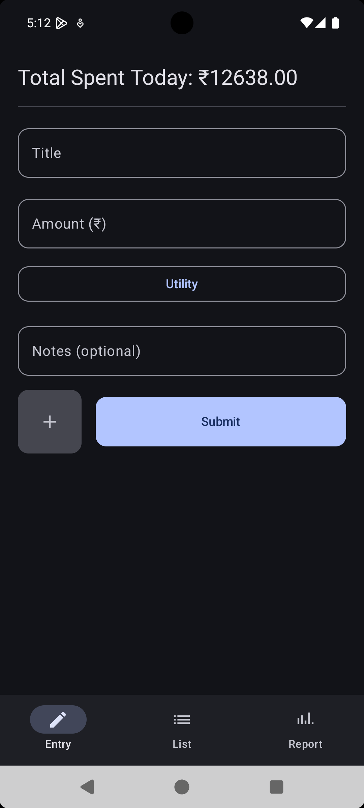
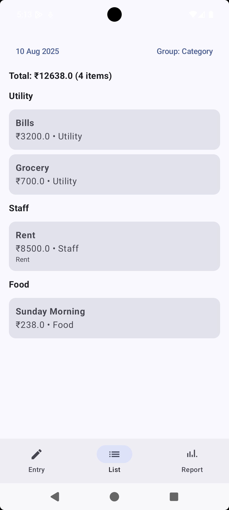
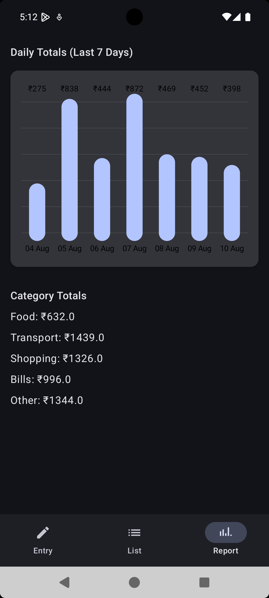

# Smart Daily Expense Tracker

## 📌 App Overview
Smart Daily Expense Tracker is a multi-screen module built for small business owners to quickly log, view, and analyze daily expenses.  
It features an intuitive Jetpack Compose UI, clean MVVM architecture, and mock analytics for better cash flow insights.  
The module allows expense entry with categories, receipt uploads, daily totals, list views, and 7-day reports with charts.

---

## 🤖 AI Usage Summary
This project was built with an **AI-first approach** using tools like ChatGPT and GitHub Copilot.  
AI assisted in:
- Designing Jetpack Compose UI layouts and state management patterns.
- Generating ViewModel, Repository, and data class scaffolding.
- Providing prompt-based UX feedback to improve screen flows and animations.
- Writing code comments, README content, and validation logic.
- Refining Kotlin syntax, navigation setup, and performance optimizations through prompt iterations.

---

## 📜 Prompt Logs (Key Prompts + Retries)
> **Prompt 1:** "Generate Jetpack Compose Expense Entry Screen with Title, Amount, Category dropdown, Notes, Receipt image picker, and Total Spent Today display, using MVVM with StateFlow."
>  
> **Prompt 2:** "Write a ViewModel for in-memory expense tracking with functions to add expense, calculate daily total, and group expenses by category."
>  
> **Prompt 3:** "Suggest a 3-screen navigation structure in Jetpack Compose with Expense Entry, Expense List, and Expense Report screens."
>  
> **Prompt 4:** "Generate mock data for last 7 days and show category-wise totals in a BarChart (mocked) in Compose."
>  
> **Prompt 5:** "Write a README for my Android assignment with overview, AI usage summary, prompt logs, and checklist."
>  
> *(Additional retries focused on fixing validation bugs, improving Compose UI padding, and adding animations on add.)*

---

## ✅ Checklist of Features Implemented
- [x] **Expense Entry Screen**
  - Title (text)
  - Amount (₹)
  - Category dropdown (Staff, Travel, Food, Utility)
  - Optional notes (≤100 chars)
  - Optional receipt image (mock)
  - Submit button with Toast + animation
  - Real-time “Total Spent Today” display
- [x] **Expense List Screen**
  - View Today’s expenses (default)
  - Filter by date
  - Group toggle: Category / Time
  - Show total count, total amount
  - Empty state handling
- [x] **Expense Report Screen**
  - Mock 7-day report with daily totals
  - Category-wise totals
  - Bar chart (mocked)
- [x] **Navigation** between all 3 screens
- [x] **State Management** with ViewModel + StateFlow
- [ ] **Export PDF/CSV** (mocked)
- [ ] **Share Intent** (optional)
- [x] **Validation**: amount > 0, title non-empty
- [x] **Bonus**: Light/Dark theme, animation on add

---

## 📱 Screenshots
| Entry Screen | List Screen | Report Screen |
|--------------|-------------|---------------|
|  |  |  |

---

## 📦 APK Download
[**Download APK**](YOUR_APK_LINK_HERE)  
*(Or find it in the `/apk/` folder in this repo.)*

---

## 🛠️ Tech Stack
- **Language:** Kotlin
- **UI:** Jetpack Compose
- **Architecture:** MVVM
- **State Management:** ViewModel + StateFlow
- **Data Layer:** In-memory Repository (Room optional)
- **Navigation:** Jetpack Navigation Compose

---

## 🚀 How to Run
1. Clone this repository:
   ```bash
   git clone https://github.com/yourusername/SmartDailyExpenseTracker.git
